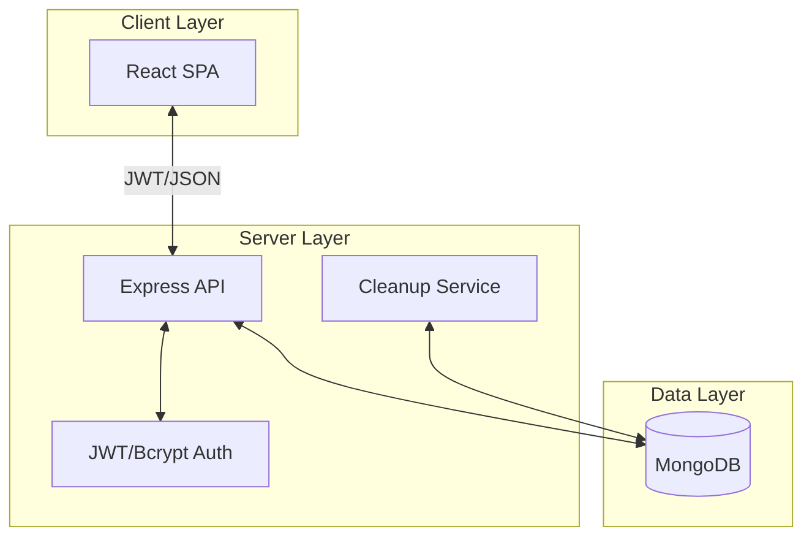

# 🛡️ Secure Notebook - MERN Stack


A secure, containerized full-stack application for managing personal notes with built-in \encryption and sharing capabilities...

## 🚀 Features

- **Authentication**: Secure registration and login using JSON Web Tokens (JWT) and HTTP-only cookies.
- **Encrypted Notes**: Protect your sensitive information with custom passcodes (hashed using `bcrypt`).
- **File Sharing**: Share notes with other users via email with an automatic 24-hour expiration.
- **Automated Cleanup**: Background process to periodically remove expired shared files.
- **CI/CD Integration**: Jenkins pipeline ready for automated builds and deployments..
- **Containerized**: Fully orchestrated with Docker and Docker Compose..

---

## 🏗️ System Design & Architecture

Secure-NoteBook is designed as a secure, scalable, and containerized application. It follows a client-server architecture with a clear separation of concerns..

### 1. High-Level Architecture

The system consists of three main layers: the React-based Frontend, the Node.js/Express Backend API, and the MongoDB Database.



### 2. Backend Design
The backend is a RESTful API built with Express.js, focusing on security and data integrity.

- **Authentication**: Uses `jsonwebtoken` for stateless authentication. Tokens are stored in `httpOnly` cookies to mitigate XSS attacks.
- **Note Security**: Supports passcode-protected notes. Passcodes are hashed using `bcrypt` before storage, ensuring that even if the database is compromised, the passcodes remain secure.
- **Data Persistence**: Mongoose is used for object modeling. The `file` model handles note content, owner identification, and sharing metadata.
- **Scheduled Tasks**: A periodic cleanup function runs to invalidate shared file access after 24 hours.

### 3. Frontend Design
The frontend is a modern Single Page Application (SPA) built with Vite and React.

- **UI/UX**: Styled with Tailwind CSS for a responsive, mobile-first design.
- **State Management**: Uses React hooks and Context API for global state (like user authentication).
- **Security**: Implements route guarding to prevent unauthenticated access to sensitive pages.

### 4. Infrastructure & DevOps
- **Docker**: Each component (frontend, backend, database) has its own `Dockerfile`.
- **Docker Compose**: Orchestrates the entire stack, including networking and volume persistence.
- **CI/CD**: A `Jenkinsfile` defines the pipeline for automated building, testing, and deployment.

---

## 🛠️ Technology Stack

- **Frontend**: React (Vite), Tailwind CSS, Axios, React Router.
- **Backend**: Node.js, Express.js.
- **Database**: MongoDB (Mongoose).
- **Security**: JWT, BCrypt, Cookie-parser.
- **DevOps**: Docker, Docker Compose, Jenkins.

---

## 📁 Project Structure

```text
Secure-NoteBook/
├── backend/            # Express server and API logic
│   ├── middleware/     # Authentication middleware
│   ├── models/        # Mongoose schemas (User, File)
│   ├── server.js      # Main server entry point
│   └── Dockerfile     # Backend container configuration
├── frontend/           # React frontend (Vite)
│   ├── src/           # Component and page logic
│   └── Dockerfile     # Frontend container configuration
├── docker-compose.yml  # Orchestrates full stack (App + DB)
└── Jenkinsfile         # CI/CD pipeline definition
```

---

## ⚙️ Setup & Running

### Prerequisites
- [Docker](https://www.docker.com/products/docker-desktop/)
- [Docker Compose](https://docs.docker.com/compose/install/)

### Installation & Execution

1. **Clone the repository**:
   ```bash
    git clone https://github.com/Sumeet2930/Secure-NoteBook
    cd Secure-NoteBook
   ```

2. **Environment Configuration**:
   Create a `.env` file in the `backend/` directory:
   ```env
   PORT=5050
   MONGO_URI=mongodb://mongodb:27017/Secure-Notebook-docker
   JWT_SECRET=your_secret_key
   ```

3. **Run with Docker Compose**:
   ```bash
   docker-compose up --build
   ```

4. **Access the App**:
   - **Frontend**: http://localhost:5173
   - **Backend API**: http://localhost:5050

---

## 🌐 Deployment (Production)

This project is configured for easy deployment on **Vercel** (Frontend) and **Render** (Backend).

### 1. Backend (Render)
1. Create a new **Web Service** on Render and connect your repository.
2. Set the **Root Directory** to `backend`.
3. Set the **Build Command** to `npm install`.
4. Set the **Start Command** to `node server.js`.
5. Add the following **Environment Variables**:
   - `MONGO_URI`: Your MongoDB Atlas connection string.
   - `JWT_SECRET`: A long, random string for signing tokens.
   - `FRONTEND_URL`: Your deployed Vercel URL (e.g., `https://your-app.vercel.app`).
   - `PORT`: `5050` (or leave it blank, Render sets it automatically).

### 2. Frontend (Vercel)
1. Create a new project on Vercel and connect your repository.
2. Set the **Root Directory** to `frontend`.
3. Vercel should automatically detect **Vite** settings:
   - **Build Command**: `vite build`
   - **Output Directory**: `dist`
4. Add the following **Environment Variable**:
   - `VITE_API_BASE_URL`: Your deployed Render backend URL (e.g., `https://your-backend.onrender.com`).

> [!IMPORTANT]
> **Cross-Domain Cookies**: The backend is configured to use `SameSite: 'None'` and `Secure: true`. Ensure your Vercel frontend is served over HTTPS (default) for authentication to work correctly.

---

## 🧪 API Endpoints (Summary)

| Method | Endpoint | Description |
| :--- | :--- | :--- |
| POST | `/api/register` | Register a new user |
| POST | `/api/login` | Authenticate user & get cookie |
| GET | `/api/files` | Get all files for the authenticated user |
| POST | `/api/upload` | Upload a new note (with optional encryption) |
| POST | `/api/shareFile` | Share a note with another user via email |
| GET | `/api/shared-files`| Fetch notes shared with the current user |
| DELETE | `/api/files/:id` | Delete a specific note |

---

## 👷 Jenkins Pipeline

The project includes a `Jenkinsfile` that automates:
1. Building Docker images.
2. Pushing images to a registry (if configured).
3. Deployment steps.

---
