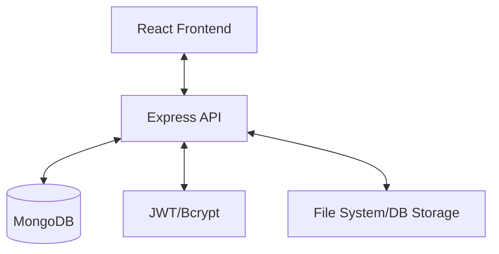

# Secure-NoteBook: System Design Draft

## 1. Architecture Overview
Secure-NoteBook follows a standard Client-Server architecture with a React-based frontend and a Node.js/Express backend, persisted by a MongoDB database (via Mongoose).

## 2. Backend Design
The backend is structured for simplicity and security.

### 2.1 API Endpoints
- **Authentication**: `POST /api/register`, `POST /api/login`, `GET /api/logout`, `GET /api/verify-token`
- **File Management**: `POST /api/upload`, `GET /api/files`, `GET /api/files/:fileId`, `DELETE /api/files/:fileId`
- **Sharing**: `POST /api/shareFile`, `GET /api/shared-files`
- **Notes**: `GET /api/notes/:fileId`, `PUT /api/notes/:fileId`
- **User Management**: `GET /api/current-user`, `GET /api/users`

### 2.2 Data Models
- **User**: Stores email, hashed password, and a list of shared files (with metadata like expiry).
- **File (Note)**: Stores filename, content, owner ID, encryption status, hashed passcode (if encrypted), and sharing visibility.

### 2.3 Security Features
- **Authentication**: JWT token stored in an HTTP-only cookie.
- **Note Encryption**: Optional passcode-based encryption. Passcodes are hashed using bcrypt before storage. *Note: Actual content encryption appears to be handled by access control rather than cryptographic content obfuscation at rest, based on the `server.js` implementation.*
- **Shared File Expiry**: A background process (via `setInterval`) runs periodically to remove expired shares.

## 3. Frontend Design
A modern Single Page Application (SPA) built with React and Vite.

### 3.1 Tech Stack
- **Styling**: Tailwind CSS for responsive and modern UI.
- **Routing**: React Router for navigation.
- **State Management**: React Context (likely for auth state).
- **Icons**: React Icons for visual elements.

## 4. Infrastructure & DevOps
- **Containerization**: Both frontend and backend are Dockerized.
- **CI/CD**: Jenkins is configured via `Jenkinsfile` for automated pipelines.
- **Orchestration**: Docker Compose is used to manage multi-container services.

## 5. Potential Enhancements
- **End-to-End Encryption (E2EE)**: Implement client-side encryption so the server never sees the raw content.
- **Persistent Sessions**: Use refresh tokens for better UX.
- **File Uploads**: Support for actual binary files (currently focuses on text-based notes).
